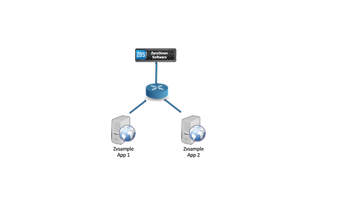
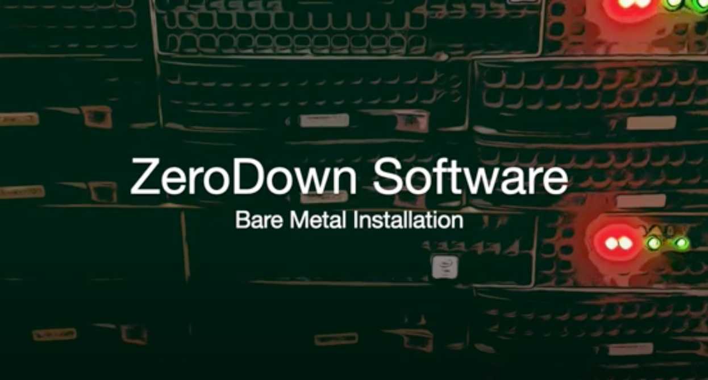
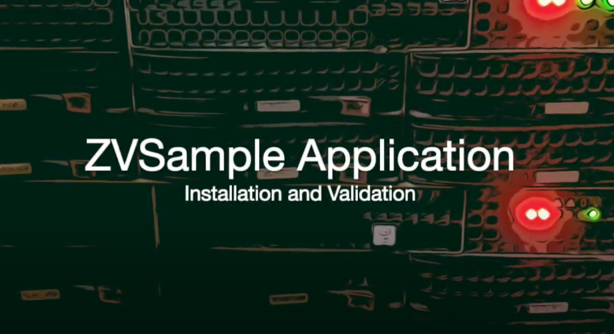
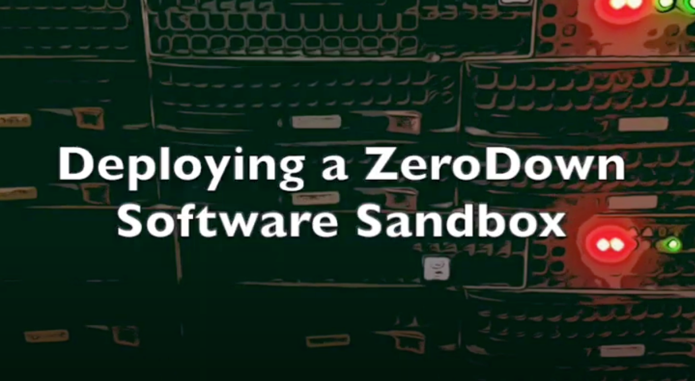

# Zerodown Software Sandbox

The following documentation outlines the process for deploying a ZeroDown Software Sandbox for testing and demonstrations.  The process presented here is visualized in YouTube videos with the included links.

## Overview

The SandBox will consist of 3 components, ZeroDown Software and 2 instances of a sample application "ZVsample". 

The process outlined is:
* Install ZeroDown Software
* Install one instance of ZVsample application
* Install second instance of ZVsample application

The following YouTube resources are available for reference:

### Installing ZeroDown Software Video:

### Installing ZVsample Application Video:

## Configuring and Testing

Once the three components have been installed, the next step is to configure ZeroDown Software, then test.

### ZeroDown Software Configuration and Testing Video:

Please visit our website [ZeroDown Software](https://zerodownsoftware.com).
